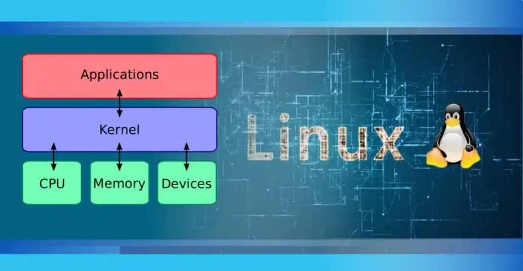

# Giới thiệu về Linux Shell và Shell Script
Nếu bạn đang sử dụng bất cứ hệ điều hành lớn nào, nghĩa là bạn đang gián tiếp tương tác với Shell. Nếu bạn đang chạy Ubuntu, Linux Mint hoặc bất cứ bản phân phối Linux nào khác, bạn đang tương tác với shell mỗi khi bạn sử dụng terminal.
Trong bài viết này tôi sẽ giới thiệu tới các bạn tổng quan về shell linux và shell script. Để hiểu shell script chúng ta cần phải làm quen với một số thuật ngữ sau:
- Kernel
- Shell
- Terminal

### I. Kernel là gì?
Kernel là một chương trình máy tính là cốt lõi của hệ điều hành máy tính, với toàn quyền kiểm soát mọi thứ trong hệ thống. Nó quản lý các tài nguyên sau của hệ thống Linux:

- File management
- Process management
- I/O management
- Memory management
- Device management ect.

Toàn bộ hệ thống Linux = Kernel + GNU system utilities and libraries + other management scripts + installation scripts.

## II. Shell là gì?
Shell là một chương trình đặc biệt cung cấp giao diện người dùng khi sử dụng các dịch vụ của hệ điều hành. Shell nhận lệnh từ con người rồi chuyển sang ngôn ngữ tương ứng của kernel, do đó có thể xem shell là một trình phiên dịch với đầu vào là các thiết bị ngoại vi hoặc file. Khi người dùng đăng nhập hoặc khởi động terminal trong Linux thì shell cũng sẽ được khởi chạy.

Shell được phân thành hai loại chính: Command Line Shell và Graphical Shell.
### 1. Command Line Shell
Shell có thể được truy cập bởi người dùng bằng cách sử dụng command line interface. Một chương trình đặc biệt có tên Terminal trong linux/ macOS hoặc Command Prompt trong Windows OS, được cung cấp để nhập vào các lệnh có thể đọc được của người dùng như "cat", "ls" etc. và sau đó nó được thực thi. Kết quả sau đó được hiển thị trên Terminal, một Terminal trong hệ thống Ubuntu 20.04

### 2. Graphical Shells
- Graphical Shells cung cấp phương tiện để thao tác với các chương trình dựa trên graphical user interface (GUI), bằng cách cho phép các hoạt động như open, close, move and resize window, cũng như chuyển trọng tâm giữa các cửa sổ.

- Window OS hoặc Ubuntu OS có thể được coi là ví dụ điển hình cung cấp GUI cho người dùng để tương tác với chương trình. Người dùng không cần nhập lệnh cho mọi hành động.

- Một số shell có sẵn trong các hệ thống Linux:
    - BASH (Bourne Again SHell) - Được sử dụng rộng rãi nhất trong các hệ thống Linux. Nó được sử dụng làm vỏ đăng nhập mặc định trong Linux / macOS. Nó cũng có thể cài đặt trên Window OS.
    
    - CSH (C Shell) - Cú pháp và cách sử dụng của C shell rất giống với ngôn ngữ lập trình C.
    
    - KSH (Korn SHell) - Korn Shell cũng là cơ sở cho các thông số kỹ thuật tiêu chuẩn của POSIX Shell,v.v.

- Mỗi shell thực hiện cùng một công việc nhưng hiểu các lệnh khác nhau và cung cấp các hàm dựng sẵn khác nhau.

## III. Shell Scripting là gì?
### 1. Shell Scripting
- Thường shell sẽ tương tác, có nghĩa là nó sẽ chấp nhận lệnh là đầu vào từ người dùng và thực thi chúng. Tuy nhiên, đôi khi chúng ta muốn thực thi một loạt các lệnh, để làm như thế chúng ta sẽ phải gõ tất cả các lệnh vào Terminal. Điều này sẽ làm cho lệnh của chúng ta dài và gây khó hiểu.
- Vì shell cũng có thể nhận các lệnh làm đầu vào từ file, chúng ta có thể viết các lệnh trong một file và có thể thực thi chúng trong shell, tránh các công việc lặp đi lặp lại. Các file này được gọi là Shell Script hoặc Shell Programs. Các Shell script tương tự như batch file trong MS-DOS. Mỗi shell script được lưu với phần mở rộng tệp .sh.
- Một shell script có cú pháp giống bất kỳ ngôn ngữ lập trình khác. Nếu bạn có kinh nghiệm với bất kỳ ngôn ngữ lập trình nào thì sẽ rất dễ dàng bắt đầu với nó.
- Shell script bao gồm các thành phần sau:
    - Shell Keywords – if, else, break etc.
    - Shell commands – cd, ls, echo, pwd, touch etc.
    - Functions
    - Control flow – if..then..else, case and shell loops etc.
### 2. Tại sao cần shell script?
- Có nhiều lý do để viết shell script:
    - Tránh các công việc lặp đi lặp lại và tự động hóa.
    - System admins sử dụng shell script để sao lưu thường xuyên
    - Giám sát hệ thống (System monitoring)
    - Thêm chức năng mới vào shell etc.
- Ưu điểm của shell script
    - Lệnh và cú pháp hoàn toàn giống với lệnh được được nhập trực tiếp trong dòng lệnh. Vì vậy lập trình viên không cần phải chuyển sang cú pháp hoàn toàn khác.
    - Viết Shell script sẽ nhanh hơn nhiều.
    - Quick start
    - Interactive debugging etc.
- Nhược điểm của shell script
    - Dễ xảy ra lỗi tốn kém, một lỗi duy nhất có thể thay đổi lệnh có thể gây hại.
    - Tốc độ thực hiện chậm.
    - Lỗi thiết kế trong cú pháp ngôn ngữ hoặc thực hiện.
    - Không phù hợp cho các task lớn và phức tạp.
    - Cung cấp cấu trúc dữ liệu ít không giống như các ngôn ngữ khác.